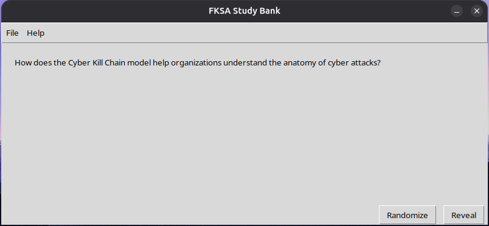

# FKSA Flash Card

v0.1

# Usage

Should work on Linux and Windows. Not tested on Mac

## To run
1. Open terminal
2. cd to folder path
3. type: python3 main.py

## To use

Main app page

Click File

Click Topic Selector, choose topic(s), then click confirm. Please note that if the topic selector is chosen again, there is no memory of the previously selected topics.

Click randomize to display question

Click reveal to reveal answer

# Prequisites

Python must be installed

## Credit

All credit to individuals who created Cyber Study Package v3.1

## Disclaimer

I am still learning, especially with building GUIs. Please let me know if there are any issues on teams
